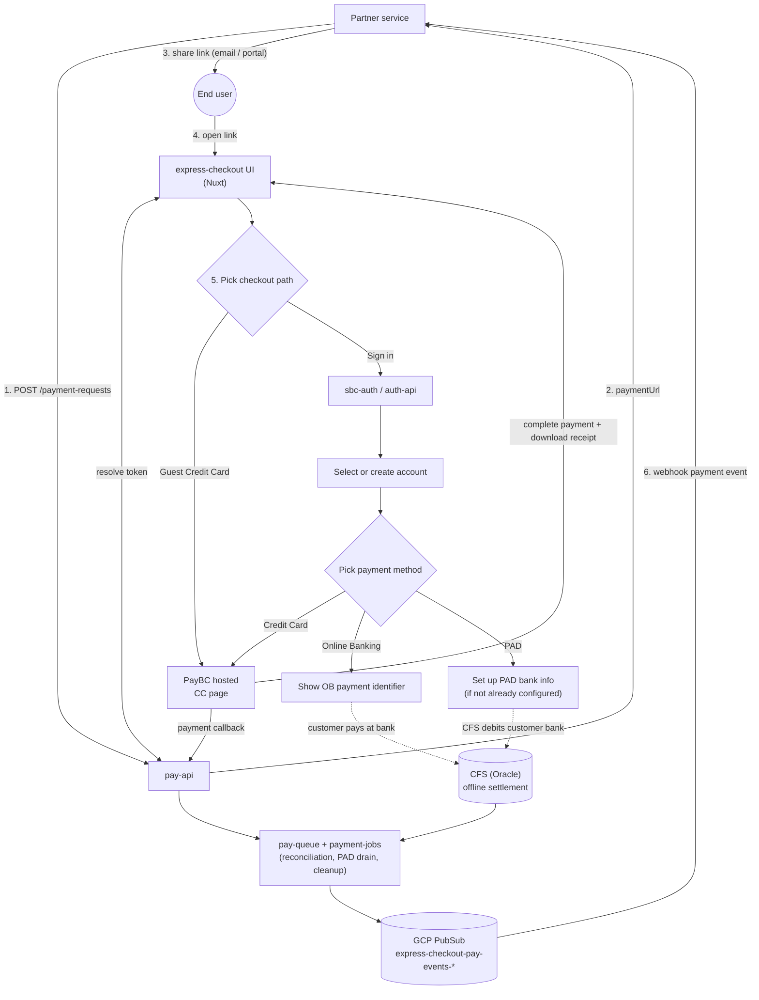
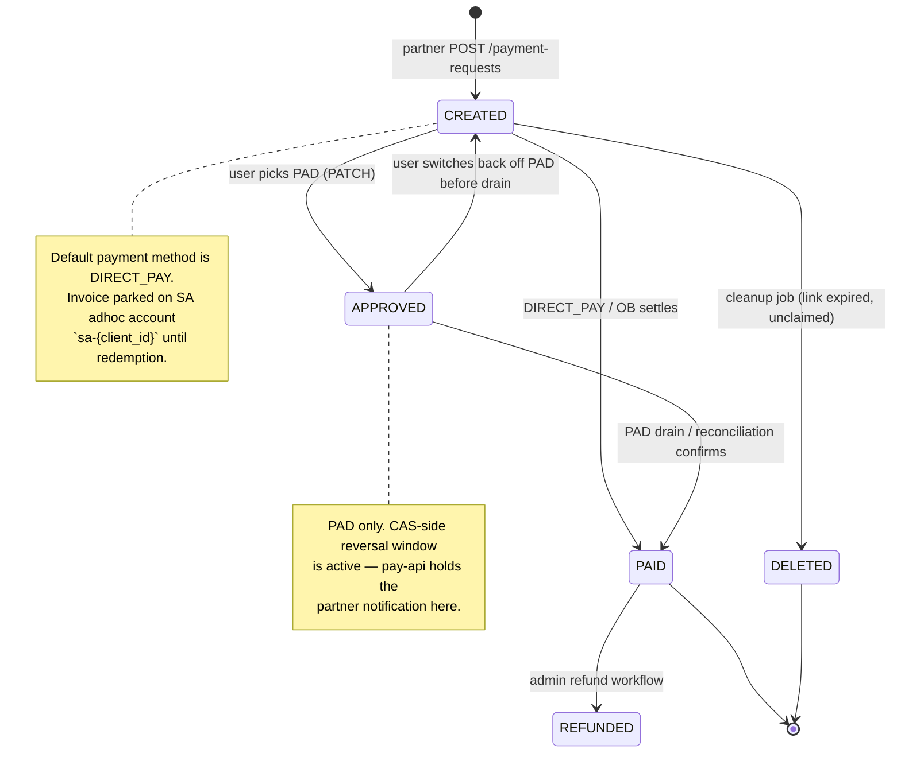
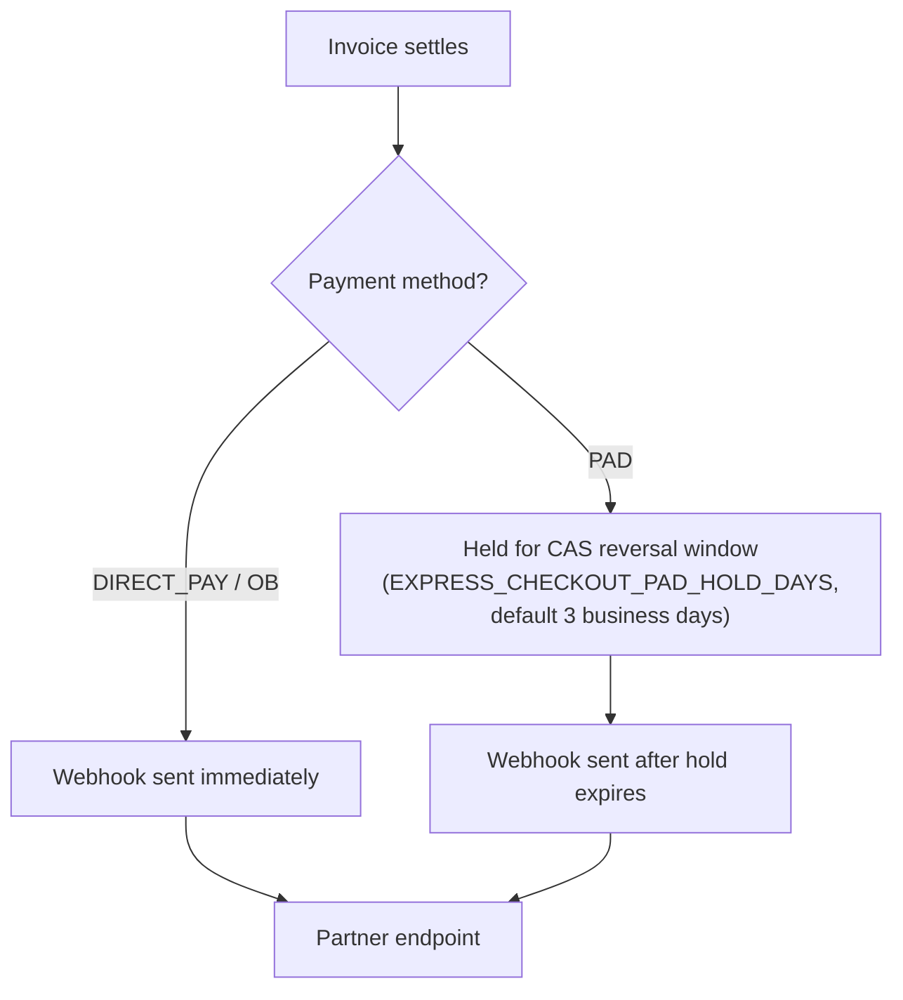

# Express Checkout — Integration Guide

Express Checkout is a payment flow for BC Registries partners where customers can complete a payment for the service using a link. A partner system creates an invoice on behalf of an end user, receives a signed URL, and hands that URL to the user (email, portal, etc.). The user clicks the link, picks or creates an account, and pays. The partner is notified of the outcome via a webhook.

This document covers the shape of the system: end-to-end integration flow, state models for the invoice and payment link, the inbound API partners call, and the outbound events partners consume.

## Contents

- [Overview](#overview)
- [Architecture at a glance](#architecture-at-a-glance)
- [Invoice lifecycle](#invoice-lifecycle)
- [Payment link lifecycle](#payment-link-lifecycle)
- [Inbound API surface](#inbound-api-surface)
- [Outbound events](#outbound-events)
- [Cleanup and expiration](#cleanup-and-expiration)
- [Error handling](#error-handling)

---

## Overview

**Partner responsibilities:**
- Hold a service-account credential with the `create_express_checkout_invoice` Keycloak realm role.
- Create invoices via `POST /payment-requests`. Store the returned `paymentUrl`, deliver it to the end user.
- Stand up a service to receive the payment events.

**BC Registries responsibilities:**
- Persist invoices and issue opaque payment-link tokens.
- Host the express-checkout UI (this Nuxt app).
- Route the user through account selection / creation, then to PayBC (or present Online Banking / PAD instructions).
- Publish a notification event when the payment is confirmed and the associated CAS reversal window has closed.
- Clean up unredeemed links after the TTL.

---

## Architecture at a glance



**Idempotency:** re-visiting the payment URL after redemption returns the already-bound invoice DTO. The link row is never re-issued.

---

## Invoice lifecycle

An express-checkout invoice moves through the standard pay-api invoice statuses.



---

## Inbound API surface

All URLs are prefixed with the pay-api base + `/api/v1`.

| Method | Path | Purpose | Auth |
|---|---|---|---|
| `POST` | `/payment-requests` | Create an express-checkout invoice (dispatched via `create_express_checkout_invoice` realm role). Returns invoice DTO + `paymentUrl`. | Partner SA JWT |
| `GET` | `/payment-links/{token}` | Resolve a token to its invoice DTO. Used by the UI's landing page. | User JWT |
| `POST` | `/payment-links/{token}/redemption` | Bind the invoice to the caller's account. Idempotent for that account. | User JWT + `Account-Id` header + `make_payment` permission |
| `GET` | `/payment-requests/{id}` | Fetch invoice details. | User JWT + `Account-Id` |
| `PATCH` | `/payment-requests/{id}` | Switch invoice payment method (DIRECT_PAY / ONLINE_BANKING / PAD). Invoice must be `CREATED`. | User JWT + `Account-Id` |
| `POST` | `/payment-requests/{id}/transactions` | Create a PayBC transaction for the invoice. | User JWT + `Account-Id` |
| `PATCH` | `/payment-requests/{id}/transactions/{txnId}` | Process the PayBC callback (called by the return page). | User JWT + `Account-Id` |

**Create-invoice request body** (partner side). For the full field reference,
see the [pay-api overview on developer.connect.gov.bc.ca](https://developer.connect.gov.bc.ca/en-CA/products/pay/overview#view-the-api):

```json
{
  "businessInfo": {
    "corpType": "ENV",
    "businessIdentifier": "TEST"
  },
  "filingInfo": {
    "filingIdentifier": "TEST001",
    "filingTypes": [ { "filingTypeCode": "SEARCH" } ]
  }
}
```


**Response includes** the invoice DTO plus:

```json
{
  "paymentUrl": "https://pay.bcregistry.gov.bc.ca/pay/<token>"
}
```

---

## Outbound events

BC Registries notifies your service when a payment settles by POSTing a webhook to an HTTPS endpoint you provide during onboarding. Register one URL per environment (test / prod). Internally BC Registries uses GCP PubSub to fan events out to partner endpoints.

**Delivery**

- Method: `HTTPS POST`
- Content-Type: `application/json`
- ACK: return any `2xx` within a few seconds. Non-2xx responses, connection failures, or timeouts trigger automatic retries with backoff.
- The webhook is fire-and-continue on our side: we don't call any partner API back before/after it. Everything you need is in the payload.

**Payload — CloudEvent envelope:**

```json
{
  "id": "<uuid>",
  "source": "sbc-pay-pay-api",
  "type": "PAYMENT",
  "time": "2026-08-14T16:18:33+00:00",
  "subject": null,
  "data": {
    "id": 42376,
    "statusCode": "COMPLETED",
    "filingIdentifier": "TEST001",
    "corpTypeCode": "ENV"
  }
}
```

**Envelope fields:**

| Field | Notes |
|---|---|
| `id` | Stable UUID for this event. Use it to dedupe retries. |
| `source` | Always `sbc-pay-pay-api`. |
| `type` | Always `PAYMENT` for express-checkout notifications. |
| `time` | ISO-8601 timestamp of event emission. |
| `data` | Payment payload — see below. |

**`data` fields:**

| Field | Values | Notes |
|---|---|---|
| `id` | integer | pay-api invoice ID — matches the invoice you received at creation. |
| `statusCode` | `COMPLETED` \| `TRANSACTION_FAILED` | `COMPLETED` on successful settlement; `TRANSACTION_FAILED` on a hard payment rejection. |
| `corpTypeCode` | e.g. `CP`, `BC`, `SP` | Corp type from the original invoice. |
| `filingIdentifier` | string \| `null` | Populated for corp-type flows that carry one. |

**Message attributes** — delivered alongside the envelope (in the PubSub push wrapper's `message.attributes`). Useful for filtering / routing without parsing the JSON body:

| Attribute | Values | Notes |
|---|---|---|
| `statusCode` | `COMPLETED` \| `TRANSACTION_FAILED` | Mirrors `data.statusCode`. |
| `corpTypeCode` | e.g. `CP`, `BC`, `SP` | Mirrors `data.corpTypeCode`. |
| `paymentMethod` | `DIRECT_PAY` \| `ONLINE_BANKING` \| `PAD` | Not present in `data`. |
| `paidAt` | ISO-8601 datetime | **PAD only.** Set by the drain job to the invoice's payment date — use it to know when the money actually cleared, distinct from the event emission `time`. |

**When events fire:**



- **DIRECT_PAY / Online Banking:** webhook fires as soon as pay-api confirms settlement.
- **PAD:** PAD invoices are held from partner notification until after the CAS reversal window closes, to avoid notifying the partner of a "paid" invoice that could still be reversed.

---

## Cleanup and expiration

**Job:** `payment_link_cleanup_task` (payment-jobs, cron-scheduled).

**Logic** (per corp type):
1. Find `invoice_payment_links` where `expires_at < now()` AND `linked_at IS NULL` (unclaimed only).
2. For each, mark the underlying invoice as `DELETED` (via the existing invoice-deletion flow — validates the invoice is still `CREATED`).
3. Do not delete the link row; it remains as an audit record with `expires_at` in the past.

---

## Error handling

**Create (`POST /payment-requests`)** — the only endpoint a partner calls directly:

| Response | Cause |
|---|---|
| `400 INVALID_REQUEST` | Missing / invalid payload. |
| `400 EXPRESS_CHECKOUT_NOT_ENABLED` | Corp type isn't opted in. |

Errors on the user-facing endpoints (link resolution, redemption, method switch, transactions) surface to the end user in the express-checkout UI; partners don't observe them directly.

**Webhook delivery failures:**

- If your endpoint returns non-2xx (or the request times out / can't connect), BC Registries retries with backoff. Successive failures do not affect the invoice — it remains settled on our side; only the notification is outstanding.
- If retries are exhausted, contact BC Registries for a manual replay.

---

## References

- Source of truth:
  - Express-checkout invoice creation: `sbc-pay/pay-api/src/pay_api/services/payment_service.py::create_express_checkout_invoice`
  - Link redemption: `sbc-pay/pay-api/src/pay_api/services/payment_link.py::PaymentLinkService.redeem`
  - PAD notification hold: `sbc-pay/pay-api/src/pay_api/services/pad_service.py::PadService.complete_post_invoice`
  - PAD drain job: `sbc-pay/jobs/payment-jobs/tasks/express_checkout_pad_notify_task.py`
  - Cleanup job: `sbc-pay/jobs/payment-jobs/tasks/payment_link_cleanup_task.py`
  - CFS create skip: `sbc-pay/jobs/payment-jobs/tasks/cfs_create_invoice_task.py::_unclaimed_express_checkout_invoice_ids`
